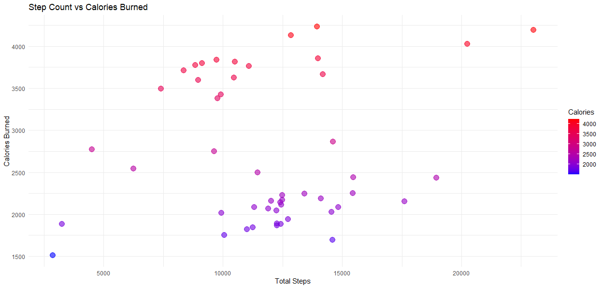

# Bellabeat Data Analysis: User Behavior & Engagement Strategy

# **📂 ASK PHASE**

### **🔹 Introduction to the Case Study**

**Bellabeat** is a **women-focused wellness technology company** that manufactures **smart health-tracking devices**. The company wants to use **data analytics** to:

📌 **Identify trends in smart device usage**

📌 **Understand user behavior patterns**

📌 **Develop data-driven marketing strategies**

### **🔹 Business Need**

Bellabeat is looking to **expand its market share** by leveraging data insights from fitness trackers. This case study will help them:

✅ Understand **how people use smart devices for fitness and wellness**

✅ Identify **opportunities for engagement and product improvements**

✅ Make **data-driven marketing decisions**

### **🔹 Key Questions We Aim to Answer**

📍 **What are the activity trends among smart device users?**

📍 **How does physical activity impact calories burned and sleep patterns?**

📍 **What are the peak activity times during the day?**

📍 **Is there a relationship between heart rate, sleep, and fitness?**

📍 **How can Bellabeat use these insights to increase user engagement?**

# 📂 PREPARE PHASE (Data Generation, Collection & Management)

### **🔹 Data Generation**

The dataset used in this analysis comes from **Fitbit Smart Device Data** **[**https://www.kaggle.com/datasets/arashnic/fitbit]. It includes data collected from **30 Fitbit users** who voluntarily shared their **physical activity, sleep patterns, heart rate, and calorie consumption** over a specific period.

The data was recorded using **wearable fitness tracking devices**, capturing minute-by-minute and daily activity levels, sleep behavior, and health metrics.

### **🔹 Data Collection**

- The data was provided in **two different folders**, each containing multiple `.csv` files.
- Some datasets were **identical in both folders**, while others had **unique data points**.
- Each dataset contained structured records with **timestamps, user IDs, and specific health metrics**.

### **🔹 Data Management & Key Datasets**

| **Dataset Name** | **Description** |
| --- | --- |
| **Daily Activity** | Tracks total steps, distance, active minutes, and calories burned per day. |
| **Hourly Steps** | Logs the number of steps taken every hour. |
| **Hourly Calories** | Measures calorie expenditure on an hourly basis. |
| **Hourly Intensities** | Monitors physical activity intensity throughout the day. |
| **Heart Rate Data** | Records heart rate changes every second. |
| **Sleep Data** | Summarizes users' total sleep time, sleep efficiency, and sleep cycles (light, deep, REM). |
| **Minute Sleep Data** | Captures sleep behavior minute by minute. |
| **Weight Log Data** | Tracks users’ weight, BMI, and weight logging patterns. |

---

# **📂 PROCESS PHASE (Data Cleaning & Integrity)**

### 📌 C**lean and refine** the data to ensure accuracy :

✅ **Duplicate Records** – Some users had multiple records for the same day.

✅ **Unrealistic Values** – Some users recorded **extremely high or low** steps, calories, or sleep times.

✅ **Missing Data** – Some records lacked steps, sleep, or weight information.

✅ **Inconsistent Formats** – Dates and column names were different across datasets.

### 📌 **Steps to clean data**

| **Category** | **Action Taken** |
| --- | --- |
| **Filtered Outliers** | **Steps:** Kept values between **2,800 and 24,000 steps/day**. |
|  | **Calories:** Removed values **below 1,500 kcal/day**. |
|  | **Heart Rate:** Ensured values were within **40–180 BPM**. |
|  | **Sleep Duration:** Limited to **4–12 hours per night**. |
| **Handled Missing Data** | **Used median values** for missing weight. |
|  | **Calculated sleep efficiency** when missing. |
|  | **Forward-filled missing heart rate values** for better accuracy. |
| **Standardized Formats** | **Converted all date fields** to a standard format. |
|  | **Renamed column names** for consistency. |
| **Merged Datasets** | **Combined all activity, sleep, heart rate, and weight data** into one structured file. |

# 📂 **ANALYZE PHASE (Exploration, Visualization & Insights)**

## **Visual Representations of Data**

### **1. Steps vs Calories Burned**

📌 **Question: Is there any correlation between steps and calories burned**

💡 **Insight:** Higher steps generally lead to **higher calories burned**, but not always in a linear way.

---

### **2. Daily Activity Breakdown**

📌 **Question:** How much time do users spend in different activity levels?

💡 **Insight:** Most users engage in **light activity**, while **very active minutes are significantly lower**.

---

### **3. Steps vs Sedentary Minutes**

📌 **Question:** Are users who take fewer steps spending significantly more time being inactive?

💡 **Insight:** There is a **negative correlation**—users with fewer steps **spend more sedentary time**.

---

### **4. Sleep Efficiency Analysis**

📌 **Question:** How efficient is users' sleep?

💡 **Insight:** Most users have **high sleep efficiency (>90%)**, but sleep duration varies.

---

### **5. Steps vs Sleep Duration**

📌 **Question:** Does physical activity improve sleep quality?

💡 **Insight:** There is **no strong correlation between steps and sleep duration**.

---

### **6. Heart Rate vs Sleep Efficiency**

📌 **Question:** Does heart rate impact sleep efficiency?

💡 **Insight:** **No strong correlation** between heart rate and sleep efficiency.

---

### **7. User BMI Distribution**

📌 **Question:** What is the weight distribution of users?

💡 **Insight:** Most users fall into the **Normal or Overweight BMI category**, with a few in the **Obese range**.

---

### **8. Hourly Intensity Heatmap**

📌 **Question:** When do users engage in high-intensity workouts?

💡 **Insight:** Peak activity in the late morning (10 AM - 1 PM) and early evening (5 PM - 7 PM), with lower activity at night and early morning.

---

### **9. Correlation Matrix Analysis**

📌 **Question:** What are the strongest correlations?

💡 **Insight:**

✅ **Steps & Calories Burned** (+0.68) → More steps = more calories burned.

✅ **Lightly Active & Total Steps** (+0.80) → Users taking more steps are mostly lightly active.

---

# 📂 SHARE PHASE (Communicating Insights)

1️⃣ **Users who take more steps generally burn more calories**, but the relationship is not always linear—other factors like workout intensity and metabolism also play a role.

2️⃣ **Most users engage in light activity, with very active minutes being significantly lower**, indicating a need for **more structured workout recommendations and movement incentives**.

3️⃣ **Users with lower step counts tend to have significantly higher sedentary minutes**, highlighting the importance of **movement reminders and inactivity alerts**.

4️⃣ **Sleep efficiency is generally high (>90%), but sleep duration varies widely**, suggesting that users might need **personalized sleep coaching to maintain consistent rest patterns**.

5️⃣ **There is no strong correlation between steps and sleep duration**, meaning physical activity alone does not guarantee better sleep—other factors like stress, routine, and lifestyle choices play a role.

6️⃣ **Users are most active in the morning and evening, with inactivity peaking at night**, which means **marketing campaigns, notifications, and engagement features should be aligned with these peak hours**.

7️⃣ **Most users fall into the Normal or Overweight BMI category, with fewer in the Obese range**, indicating an opportunity for **personalized fitness plans and weight management recommendations**.

# 📂 ACT PHASE

📌 **Introduce step-based challenges and movement rewards** to keep users engaged and encourage daily activity.

📌 **Offer customized workout programs** to increase very active minutes and improve overall fitness.

📌 **Implement inactivity alerts and movement reminders** in the Bellabeat app to reduce sedentary behavior.

📌 **Introduce stress management & relaxation techniques** to enhance sleep quality beyond physical activity.

📌 **Offer personalized fitness and weight management plans** to cater to users with different BMI levels.
