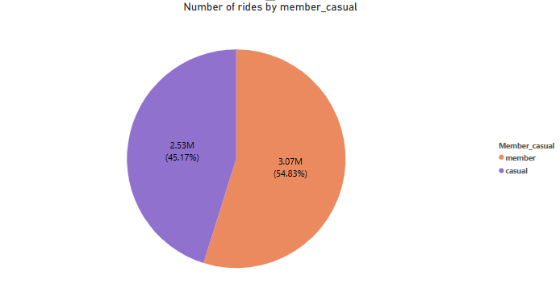

# Cyclistic

## **📂 ASK PHASE: Business Challenge & Objectives**

### **📌 Business Challenge**

Cyclistic, a Chicago-based bike-sharing company, provides customers with single-ride passes, day passes, and annual memberships. The company’s financial analysts have determined that **annual members generate more revenue than casual riders**. The marketing team is now looking for **strategies to convert more casual riders into annual members** to maximize long-term revenue.

### **📌 Key Objectives**

1️⃣ **Understand how casual riders and annual members use the service differently.**

2️⃣ **Identify patterns in ride duration, frequency, and time-of-day usage.**

3️⃣ **Provide data-driven recommendations** to encourage casual riders to purchase annual memberships.

### **📌 Key Stakeholders**

- **Cyclistic Marketing Team** – Interested in crafting targeted marketing strategies for membership conversion.
- **Cyclistic Executive Team** – Decision-makers who need **data-backed insights** before approving new initiatives.

---

## **📂PREPARE PHASE: Data Generation, Collection & Management**

### **📌 Data Collection**

- The dataset was obtained from **Divvy’s publicly available bike-share trip records**.
- It contains **12 months of ride data** (January–December 2021). [[Index of bucket "divvy-tripdata"](https://divvy-tripdata.s3.amazonaws.com/index.html)]
- The data is sourced from **Motivate International Inc.**, which manages the Divvy bike-share system in Chicago.

### **📌 Data Storage & Management**

- The dataset consists of **12 individual monthly CSV files**, which were merged into a **single structured dataset** for analysis.
- The dataset does **not contain Personally Identifiable Information (PII)** to respect user privacy.

### **📌 Data Structure & Key Features**

| **Column Name** | **Description** |
| --- | --- |
| `ride_id` | Unique identifier for each ride |
| `started_at` | Ride start timestamp |
| `ended_at` | Ride end timestamp |
| `ride_length` | Duration of ride (in minutes) |
| `member_casual` | Indicates if the user is a casual rider or an annual member |
| `start_station_name`, `end_station_name` | Origin and destination stations for each trip |

---

## **📂 PROCESS PHASE: Data Cleaning & Integrity**

📌 **1. Merging Monthly Data**

- The **12 months of trip data** were combined into a single table using SQL (`UNION ALL`).

📌 **2. Handling Missing Data**

- **`end_station_name` and `end_station_id`** had missing values, which were replaced with `"Unknown"` to maintain consistency.
- **NULL timestamps** (`started_at`, `ended_at`) were removed to avoid calculation errors.

📌 **3. Creating a New Column (`ride_length`)**

- Calculated the **difference between ride start and ride end times** to determine the duration of each trip.

📌 **4. Removing Outliers**

- **Negative ride lengths** (likely data errors) were removed.
- **Unrealistic ride durations (>24 hours)** were excluded to avoid skewing analysis.

📌 **5. Data Integrity Check**

- Verified ride distributions by **membership type**, **day of the week**, and **ride duration** to confirm data consistency before analysis.

## **📂 ANALYZE Phase**

1. **Total Rides by Membership Type**

 💡 **Insight:**         

- **54.83% of rides** were by members, while **45.17%** were from casual riders.
- This indicates that casual riders represent a large portion of usage but are not contributing consistently to revenue.
1. **Ride Trends by Day of the Week**

💡 **Insight:**  

- **Weekdays:** Members take more rides, suggesting regular commuters.
- **Weekends:** Casual riders increase significantly, particularly on **Sundays**, indicating leisure-based usage.
1. **Ride Length Comparison**

💡 **Insight:**  

- The median ride duration for **casual riders** is significantly longer than for **members**
- Casual users have a **wider interquartile range (IQR)**, meaning their ride lengths vary greatly. Some take **very short rides**, while others take **extended trips**.
1. **Peak Usage Hours**

💡 **Insight:**  

- **Members:** More active during **morning and evening rush hours**, suggesting work commutes.
- **Casual Riders:** Use bikes more in the **afternoon and evening**, likely for recreational purposes.

## **📂 Share Phase**

- Casual users have a **median ride length significantly longer** than members, suggesting they use the service more for leisure than quick commutes.
- The ride duration of members is **shorter and more predictable**, reinforcing that they likely use the service for **daily commuting or routine travel**.
- Casual users display a **wider range of ride times**, with **many outliers indicating extended rides**, especially on weekends.
- **Members ride more on weekdays**, likely for commuting, while **casual riders are more active on weekends**, aligning with recreational use.
- Many casual users take **exceptionally long rides**, showing they **value** the service.

## **📂 Act Phase**

**📌 Launch Weekend Membership Promotions**

- Since **casual riders take longer rides, especially on weekends**, offer **weekend membership discounts or free trial days** to showcase the benefits of becoming a member.

**📌 Introduce Flexible Membership Options**

- Create **short-term or pay-as-you-go memberships** for casual riders who may hesitate to commit to an annual plan. A **monthly commuter pass** could appeal to weekend users who ride frequently.

**📌 Target Casual Riders with Personalized Marketing**

- Use **email campaigns, in-app notifications, and social media ads** to directly target casual riders who frequently take long trips, **highlighting savings and perks of memberships**.

**📌 Improve Commuter Perks for Members**

- Offer **exclusive benefits for members**, such as **priority access to bikes at peak hours, bonus ride credits, or referral incentives** to encourage long-term commitment.

**📌 Offer Loyalty Rewards for Frequent Casual Riders**

- Implement a **loyalty points system** where casual riders **earn discounts** on memberships based on the number of rides they take.
