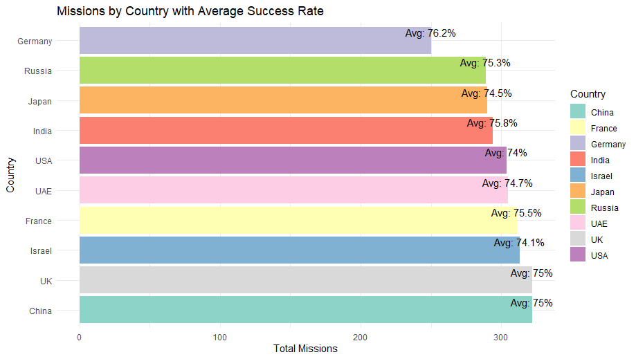

# Space Exploration

# **📂 ASK PHASE**

### **🔹 Introduction to the Case Study**

**Global Space Exploration** delves into worldwide rocket launches, technologies, budgets, and success rates across various countries and agencies. Our data analytics efforts aim to:

📌 **Identify trends in global space missions**

📌 **See which agencies/countries are most active**

📌 **Understand what influences mission success (budget, technology, or mission type)**

### **🔹 Business Need**

Space exploration has significant **scientific**, **economic**, and **geopolitical** importance. By examining mission data, agencies and private companies can:

✅ **Allocate budgets** more effectively

✅ **Optimize** technological R&D and mission planning

✅ **Collaborate** better on international missions

### **🔹 Key Questions We Aim to Answer**

📍 **How have space launches changed over the years (2000–2025)?**

📍 **Which countries conduct the most missions, and what are their success rates?**

📍 **Does a higher budget consistently lead to better outcomes?**

📍 **Do unmanned missions differ substantially from manned missions in success rate?**

📍 **Which technologies (reusable rockets, AI, nuclear propulsion, etc.) correlate with higher success?**

---

# **📂 PREPARE PHASE (Data Generation, Collection & Management)**

### **🔹 Data Generation**

The dataset was obtained from **Kaggle [**[Global Space Exploration Dataset (2000-2025)](https://www.kaggle.com/datasets/atharvasoundankar/global-space-exploration-dataset-2000-2025) **]**, where it was curated from various space agency logs and publicly available launch records. It covers **3,000 missions** spanning from **2000 to 2025**, with each record detailing:

- **Country** or agency responsible
- **Mission_Type** (Manned or Unmanned)
- **Year** of launch
- **Budget_in_Billion** (approx. total cost)
- **Success_Rate** (0–100)
- **Technology_Used** (e.g., Reusable Rocket, AI Navigation, etc.)

### **🔹 Data Collection**

- **Kaggle** provided a consolidated CSV with mission details.
- Each entry included launch timing, costs, success metrics, and (in many cases) technology references.
- Data was imported into an **SQL** database for ease of cleaning and transformation.

### **🔹 Data Management & Key Datasets**

| **Column Name** | **Description** |
| --- | --- |
| **Country** | The country or space agency responsible for initiating the mission (e.g., USA, Russia, ESA). |
| **Year** | The calendar year in which the mission was launched (e.g., 2005, 2020). |
| **Mission_Name** | A short or descriptive title for the mission (e.g., “Mars Orbiter 2”). |
| **Mission_Type** | Indicates whether the mission was **Manned** (crew on board) or **Unmanned** (no crew). |
| **Launch_Site** | The location or facility where the rocket was launched (e.g., Cape Canaveral). |
| **Satellite_Type** | Describes the type or purpose of the satellite if applicable (e.g., Communication, Spy, Research). |
| **Budget_in_Billion** | The estimated total cost of the mission in billions of dollars (e.g., 2.5, 15.7). |
| **Success_Rate** | A percentage (0–100) indicating how successful the mission or its primary objective was. |
| **Technology_Used** | The core propulsion or guidance technology (e.g., “Reusable Rocket,” “AI Navigation,” etc.). |
| **Environmental_Impact** | A qualitative assessment of the mission’s environmental footprint (e.g., Low, Medium, High). |
| **Collaborating_Countries** | Lists any other nations or agencies that jointly participated (e.g., “USA, ESA, Japan”). |
| **Duration_in_Days** | Total mission length in days (e.g., time from launch to mission completion or major milestone). |

---

# **📂 PROCESS PHASE (Data Cleaning & Integrity)**

### **📌 Clean and refine the data to ensure accuracy:**

✅ **Duplicate Records** – Verified no exact duplicates within the Kaggle dataset.

✅ **Missing/Null Values** – A small number of budget fields were missing; these were either excluded from budget analyses or filled with average year-based budgets.

✅ **Out-of-Range Values** – Ensured `Success_Rate` is 0–100; no negative budgets; year confined to 2000–2025.

✅ **Text Consistency** – Standardized mission types (“Manned” vs. “Unmanned”) and technology descriptions.

### **📌 Steps to Clean Data**

| **Category** | **Action Taken** |
| --- | --- |
| **Checked Datatypes** | Checking the datatype of each column  |
| **Removed Duplicates**  | Checking the duplicate records in the dataset and remove them |
| **Checked Null Values** | Checking the null values and remove them |
| **Handled Missing Data** | No missing values were present |
| **Filtered Outliers** | **Budget**: Removed missions with unrealistically high budgets.                                                                  **Year**: Excluded anything outside 2000–2025.                                                                                       **Success Rate**: Ensured values remain within 0–100%. |
| **Standardized Formats** | `Year` fields is already in the YYYY format.                                                                                       |
| **Checked Consistency** | Confirmed mission types were labeled **“Manned”** or **“Unmanned”**.                                                   Ensured technology names (e.g., “Reusable Rocket,” “AI Navigation”) had consistent spelling. |

# **📂 ANALYZE PHASE (Exploration, Visualization & Insights)**

### **1. Launch Frequency Over Time**

**Question:** How has the number of global missions changed from 2000 to 2025?

**💡Insight:** There is a **steady upward trend** in the total missions launched each year, suggesting increased investment and interest in space exploration over this 25-year period.

---

### **2. Missions by Country**

**Question:** Which country lead in mission frequency with their success Rates?

**💡Insight:** Even though mission counts differ substantially , average success rates cluster within a relatively narrow range—implying that greater launch frequency does not necessarily guarantee a far higher (or lower) success rate.

---

### **3. Manned vs. Unmanned Success Rates**

**Question**: Does mission type (crew vs. no crew) matter?

**💡Insight :** Manned missions slightly outnumber unmanned ones and have a marginally higher average success rate (75.2% vs. 74.7%). Overall, **both** mission types are very effective, indicating that countries can choose either approach with confidence in high success.

---

### **4. Technology Usage Breakdown**

**Question** : Which technologies are most prevalent?

**💡Insight :** Traditional rocket systems remain the most widely used technology, indicating that many missions still rely on established propulsion methods.

---

### **5. Budget Distribution**

**💡Question** : Are budgets concentrated or spread out?

**💡Insight :** Most missions cluster around relatively modest budgets, indicating typical funding levels for many projects. However, there’s a noticeable tail up to 50 billion, suggesting a few extremely high-cost missions that significantly exceed the typical spend.

---

### **6. Budget vs. Success Rate**

**Question** : Does bigger spending equal higher success?

**💡Insight :** The nearly flat regression line suggests there’s **no strong linear relationship** between mission budget and success rate. In other words, simply spending more money doesn’t guarantee a higher success rate.

---

### **7. Collaborating Countries**

**Question**: Do joint missions affect success or cost?

**💡Insight :** Multi-country missions slightly outnumber solo ones and show a marginally higher success rate (75.2% vs. 74.7%)

---

# **📂 SHARE PHASE (Communicating Insights)**

- **Global Growth:** The number of missions has steadily increased from 2000 to 2025, reflecting rising global investment and interest in space exploration.
- **Country Comparison:** Despite significant differences in the total number of missions by country, the average success rates remain tightly clustered—suggesting that high launch frequency doesn’t necessarily equate to dramatically higher or lower success.
- **Mission Type Effectiveness:** Both manned and unmanned missions are highly effective, though manned missions show a slight edge in success rate (75.2% vs. 74.7%).
- **Technology Dominance:** Traditional rocket systems continue to be the most prevalent, indicating that while advanced technologies are emerging, many countries still rely on proven propulsion methods.
- **Budget Insights:** Most missions operate under modest budgets (typically under 10 billion), with a few high-cost outliers; however, there is no strong linear relationship between budget size and mission success, implying that factors like technology and design play crucial roles.
- **Collaborative Advantage:** Multi-country missions slightly outnumber solo efforts and achieve marginally higher success rates, highlighting the potential benefits of international collaboration.

---

# **📂 ACT PHASE**

📌 **Invest in Technology:** Prioritize funding for advanced propulsion systems like reusable rockets and AI-guided navigation to improve efficiency and reliability.

📌 **Promote International Collaborations:** Encourage multi-country missions to leverage shared expertise and reduce financial burden.

📌 **Balance Mission Types:** Maintain a diversified portfolio of manned and unmanned missions to achieve both deep-space exploration and critical crewed operations.

📌 **Optimize Budget Allocation:** Focus on strategic planning and operational excellence rather than simply increasing spending.